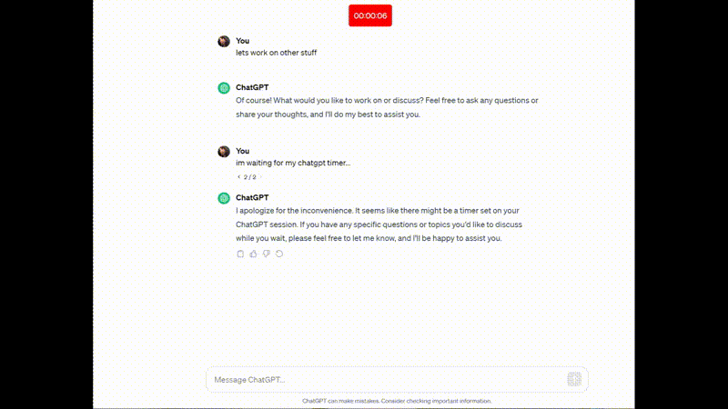

# ChatGPT Timer Chrome Extension

## About
ChatGPT Timer is a Chrome extension designed to enhance your experience with ChatGPT by providing a handy timer feature. It allows users to set timers and get notified when it's time to use ChatGPT4, ensuring a more productive and organized interaction with ChatGPT.

## Demo

## Features
- **Easy Timer Setting**: Set a timer with just a few clicks directly from the ChatGPT interface.
- **Persistent Functionality**: The timer persists across page refreshes, ensuring continuity in your ChatGPT sessions.
- **End-of-Timer Notification**: Get notified with a visual and/or audio alert when your timer ends, regardless of your current tab or window.
- **User-friendly Interface**: Enjoy a simple and intuitive interface for setting and viewing your timer.
- **Efficient and Unobtrusive**: Lightweight design that runs efficiently in the background without slowing down your browser.
- **Manual Dismiss Option**: The timer can be manually dismissed with a click, providing flexibility in managing your time on the ChatGPT site.

## Installation
To install the ChatGPT Timer Chrome Extension:
1. Clone this repository or download the ZIP file.
2. Open Chrome and go to `chrome://extensions/`.
3. Enable Developer Mode (top right corner).
4. Click on "Load unpacked" and select the directory where you cloned or extracted the extension.
5. The extension should now be installed and ready to use.

## Usage
- Once your ChatGPT4 usage limit is reached, a red notification will appear on the ChatGPT site with the message "Set Timer ⏰".
- Click on this notification to set up the timer. The red countdown timer will appear with the remaining time.
- You can continue browsing or working, and the timer will run at the top of the page.
- When the timer ends, you will receive a notification. This feature helps you manage your time effectively on the ChatGPT site.
- The timer is persistent and will not reset or stop even if the page is refreshed or chat is switched.
- It can be manually dismiss it by clicking on it.

## Contributing
Contributions to ChatGPT Timer are welcome! Please read our [contributing guidelines](CONTRIBUTING.md) for details on how to contribute to this project.

## License
This project is licensed under the [MIT License](LICENSE).

## Acknowledgments
- Special thanks to everyone who enjoys this project.

## Contact
For any queries or suggestions, please feel free to contact me.

## Version
Current version: 1.0
